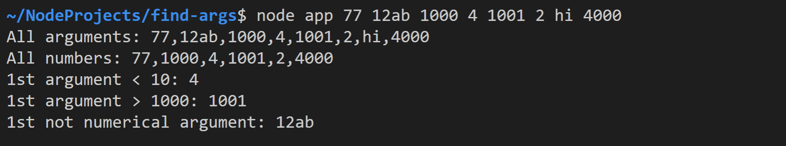

# Analyze Arguments With Array Methods

Erstellen Sie die Datei `app.ts` und entwickeln Sie darin eine Applikation mit folgender Ausgabe:



**Wichtig:** Verwenden Sie bei jeder Aufgabe eine der folgenden Array-Methoden:

- `filter()`
- `find()`

## Task 1: Print all arguments

Zuerst sollen alle CLI Argumente ausgegeben werden, die beim Programmstart übergeben wurden. Verwenden Sie hierbei folgende Anweisung:

```javascript
console.log(`All arguments: ${args}`);
```

## Task 2: Print all numbers

Speichern Sie als Nächstes alle übergebenen Zahlen in einer Variable vom Datentyp `number[]` und geben Sie des anschließend aus.

## Task 3: First argument < 10

Suchen Sie die erste Zahl, die kleiner als 10 ist, und geben Sie dies aus.

## Task 4: First argument > 1000

Suchen Sie die erste Zahl, die größer als 1000 ist, und geben Sie dies aus.

## Task 5: First not numerical argument

Suchen Sie das erste Argument, das nicht in eine Zahl umgewandelt werden kann, und geben Sie dieses aus.
